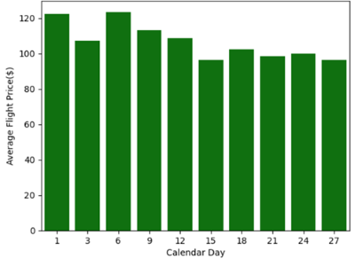
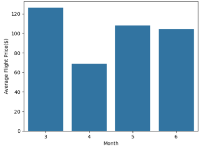
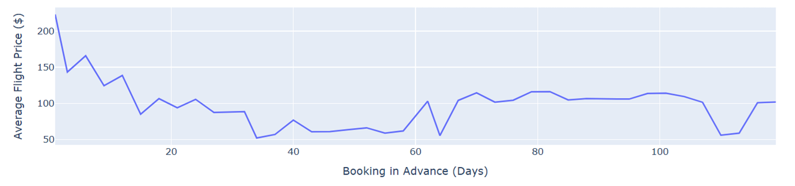
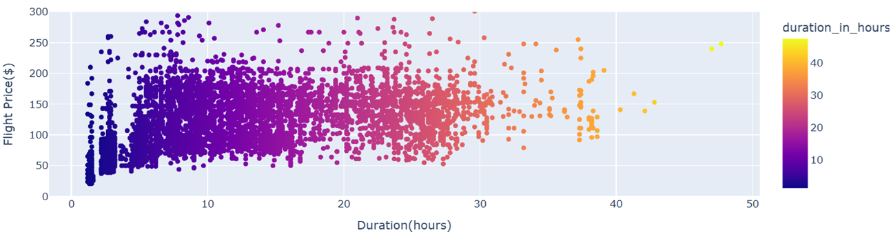
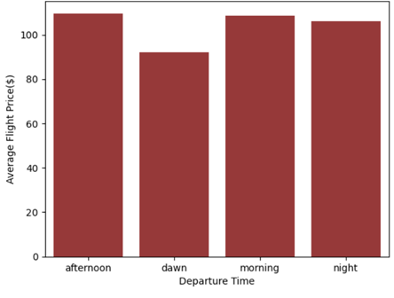
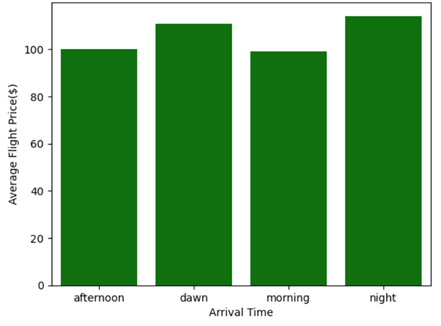

# Flight Prices Prediction 

## Project Overview
Airlines in India are facing intense competition in domestic market, with price being a key factor, especially for low-cost carriers. The Head of the Pricing Strategy Department from Swift Airline understands flight prediction models in the market utilize features, such as:
- Historical price data
- Booking lead time
- Seasonality & holidays
- Flight demand	
- Route & destination
- Airport choice

However, for this newly founded airline to stand out, relying solely on existing tools in the market is not sufficient. He has requested the data analytics team to build a predictive model using features as per tools in current market, and another one integrating additional features, such as:	
- Skytrax rating
- Number of staff
- Number of aircrafts
- Flight models owned

He wants to know if adding features would help in building a more accurate model and which machine learning model fits the best. A sophisticated and flexible pricing strategy would help Swift Airline react faster to market changes and ensure it stands out in a highly competitive industry.

## Table of Contents
1. [Problem Definition](#problem-definition)
2. [Data Collection](#data-collection)
3. [Data Exploration](#data-exploration)
4. [Data Cleaning](#data-cleaning)
5. [Analysis](#analysis)
6. [Modeling (if applicable)](#modeling)
7. [Results and Insights](#results-and-insights)
8. [Conclusion](#conclusion)
9. [Future Work](#future-work)

## Problem Definition
- What is the problem or challenge you're trying to address?
- What are the key business questions or goals?
- Define any hypotheses you are testing.

## Data Collection
- **Dataset Overview**: Kaggle's ‘flight_price_prediction_dataset.csv’, 11 columns x 10683 rows
- **Data Description**: Historical Price Data, Date of Journe, Source, Destination, Route, Total Stops, etc.
- **Additional Info**: Merged with additional dataset: Number of Staff, Number of Aircrafts, Aircraft Models, etc.

## Data Limitations
- **Limited training data**: Only from March to June 2019
- **Historical biases**: E.g., during economic downturns or periods of low demand can skew predictions
- **Macroeconomic events**: Factors like oil price changes, pandemics, or geopolitical instability (e.g., wars, government regulations) can drastically alter flight pricing

## Data Cleaning
- **Missing Values**: Dropped 1 row with route & total stops are null
- **Outliers**: Removed one row with ‘5m’ duration
- **Duplicates**: Removed 220 duplicate rows 
- **Data Transformation**: Converted all the column names to lower case, standardized the name in ‘airline’, converted data to the correct format
  
## Analysis
- **Feature Engineering**:
  -	Created ‘month’ and ‘day’ from ‘date of journey’
  -	Created ‘days left’: [‘date_of_journey’] – [28-Feb-2019]
  -	Created ‘skyrax_rating’, ‘inflight meal’, ‘checked_in _luggage’
  -	Converted ‘dep_time’ to ‘dep_session’: dawn, morning, afternoon, night
  -	Converted ‘arrival_time’ to ‘arr_session’: dawn, morning, afternoon, night
  -	Created ‘day_of_week’ from ‘date of journey’
  -	Converted ‘price’ to ‘price_usd’
  -	Converted ‘duration’ in hour and minutes to ‘duration_in_hours’ in hour format
  - Replaced number of stops with numerical value
- **Exploratory Data Analysis (EDA)**: Provide detailed insights into the data (e.g., trends, correlations, patterns).

    Distribution of flight prices: $40 – 50 is the most common flight prices

  

 

 

 

 

 

 
  
## Modeling (if applicable)
- **Model Selection**: Describe the models you chose (e.g., regression, classification, clustering).
- **Modeling Process**: Discuss how you split the data (train/test), parameter tuning, and evaluation metrics (e.g., accuracy, RMSE, F1 score).
- **Model Results**: Present the results from the models, such as performance metrics and any visualizations like ROC curves or confusion matrices.

## Results and Insights
- **Key Findings**: Summarize the insights you gained from the analysis and modeling.
- **Business Implications**: Discuss the practical implications of your findings (e.g., how the results can be used to improve decision-making or strategy).
- **Visualizations**: Include charts or graphs to support your insights (e.g., bar charts, line graphs, pie charts).

## Conclusion
- **Summary**: Provide a summary of the main findings and their importance.
- **Limitations**: Mention any limitations or challenges encountered during the analysis.
- **Recommendations**: Provide recommendations based on your analysis (e.g., further analysis, strategy changes).

## Future Work
- **Improvement Areas**: Discuss any ways the analysis could be expanded or improved in future work.
- **Next Steps**: Suggest potential next steps or further research areas (e.g., deploying a predictive model, integrating more data sources).

---

### References
- List any sources you consulted during the project (e.g., research papers, blog posts, tutorials, or dataset documentation).

---

## Appendix (Optional)
- Any additional information, code, or results that are not critical to the main report but may be useful for reference.

