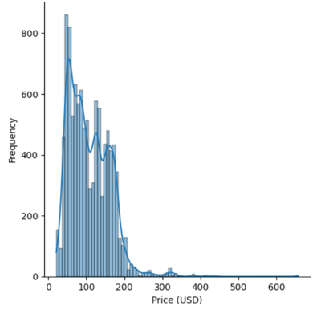
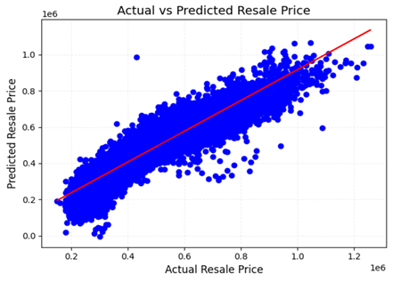
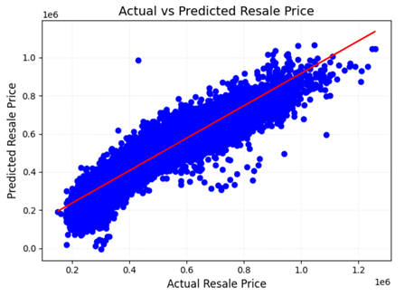

# Flight Prices Predictive Modeling

## Project Overview
Airlines in India are facing intense competition in domestic market, with price being a key factor, especially for low-cost carriers. The Head of the Pricing Strategy Department from Swift Airline understands flight prediction models in the market utilize features, such as:
- Historical price data
- Booking lead time
- Seasonality & holidays
- Flight demand	
- Route & destination
- Airport choice

However, for this newly founded airline to stand out, relying solely on existing tools in the market is not sufficient. He has requested the data analytics team to build a predictive model using features as per tools in current market, and another one integrating additional features, such as:	
- Skytrax rating
- Number of staff
- Number of aircrafts
- Flight models owned

He wants to know if adding features would help in building a more accurate model and which machine learning model fits the best. A sophisticated and flexible pricing strategy would help Swift Airline react faster to market changes and ensure it stands out in a highly competitive industry.

## Table of Contents
1. [Problem Definition](#problem-definition)
2. [Data Collection](#data-collection)
3. [Data Exploration](#data-exploration)
4. [Data Cleaning](#data-cleaning)
5. [Analysis](#analysis)
6. [Modeling (if applicable)](#modeling)
7. [Results and Insights](#results-and-insights)
8. [Conclusion](#conclusion)
9. [Future Work](#future-work)

## Problem Definition
- Problem Statement
  - Flight price predictions in the market are based on factors ‘Group 1’. Head of Pricing Strategy Department from Swift Airline would like to know if adding in factors in ‘Group 2’ would make the prediction more accurate.
  
  | Group 1 | Group 2 |
  | --- | --- |
  | Historical price data | Skytrax rating |
  | Booking lead time | Fleet |
  | Seasonality and holidays | Flight models |
  | Flight demand | Number of staff |
  | Route and destination|  |
  | Airport choice|  |
- Audiences
  - Swift Airline pricing strategy department 
- Goals
  - Build a linear regression model with:
    - features in group 1
    - features in group 1 + group 2
  -	Use features from linear regression model that has higher R2 and lower RMSE for other machine learning models to see if higher R2 and lower RMSE can be obtained.
  -	Develop an interactive dashboard 

## Data Collection
- **Dataset Overview**: Kaggle's ‘flight_price_prediction_dataset.csv’, 11 columns x 10683 rows
- **Data Description**: Historical Price Data, Date of Journe, Source, Destination, Route, Total Stops, etc.
- **Additional Info**: Merged with additional dataset: Number of Staff, Number of Aircrafts, Aircraft Models, etc.

## Data Limitations
- **Limited training data**: Only from March to June 2019
- **Historical biases**: E.g., during economic downturns or periods of low demand can skew predictions
- **Macroeconomic events**: Factors like oil price changes, pandemics, or geopolitical instability (e.g., wars, government regulations) can drastically alter flight pricing

## Data Cleaning
- **Missing Values**: Dropped 1 row with route & total stops are null
- **Outliers**: Removed one row with ‘5m’ duration
- **Duplicates**: Removed 220 duplicate rows 
- **Data Transformation**: Converted all the column names to lower case, standardized the name in ‘airline’, converted data to the correct format
  
## Analysis
- **Feature Engineering**:
  -	Created ‘month’ and ‘day’ from ‘date of journey’
  -	Created ‘days left’: [‘date_of_journey’] – [28-Feb-2019]
  -	Created ‘skyrax_rating’, ‘inflight meal’, ‘checked_in _luggage’
  -	Converted ‘dep_time’ to ‘dep_session’: dawn, morning, afternoon, night
  -	Converted ‘arrival_time’ to ‘arr_session’: dawn, morning, afternoon, night
  -	Created ‘day_of_week’ from ‘date of journey’
  -	Converted ‘price’ to ‘price_usd’
  -	Converted ‘duration’ in hour and minutes to ‘duration_in_hours’ in hour format
  - Replaced number of stops with numerical value
- **Exploratory Data Analysis (EDA)**: 

    Distribution of flight prices: <ins>$40 – 50 is the most common flight prices<ins>

    

    Average flight price by calendar day: <ins>Flight price is the most expensive on 1st & 6th of the month<ins>
  
    

    Average flight price by month: <ins>Flight price is the lowest in April<ins>
    
    

    Average flight price by booking in advance (days): <ins>Flight price is the highest if one books and travels on the same day<ins>
    
    

    Flight prices across different durations: <ins>Flight prices positively correlates with durations<ins>
    
    

    Flight price by departure session: <ins>Flight price is lowest if departure session is dawn<ins>
    
    

    Flight price by arrival session: <ins>Flight price is slightly lower if arrival session is morning or afternoon<ins>
    
    

## Key Features
**Group 1**
- Day & Month
- Airline
- Departure & Arrival Session
- Total stops
- Duration
- In-flight meal
- Checked in luggage
- Booking in advance

**Group 2**
- Skytrax rating
- Number of aircrafts
- Number of staff

## Modeling - Linear Regression
- Correlation between key factors < ±0.9
- Linear relationship between flight price and different factors .

- Model 1 (Using Group 1)

  

  - RMSE: 33.51
  - R2 Score : 0.6112

- Model 2 (Using Group 1 + Group 2)

  

  - RMSE: 33.50
  - R2 Score : 0.6115

## Exploring Other Models
  | Criteria | Gradient Boosting | Random Forest | Cat Boost | XGB |
  | --- | --- | --- | --- | --- |
  | RMSE | 24.24 | 23.89 | 21.89 | 22.76 |
  | R2 Score | 0.7966 | 0.8024 | 0.8341 | 0.8206 |

## Recommendations
It is recommended to use CatBoost Regression for this task, as it consistently yields the lowest RMSE and the highest R² score compared to other models. This machine learning technique effectively leverages features from both Group 1 and Group 2, making it particularly well-suited for predicting flight prices.
The model is designed to forecast daily flight prices for competing airlines up until the journey date by incorporating real-time data. Swift Airline can use this information to dynamically adjust its own pricing strategy. 

**Case 1: Flash sales by competitor on similar route**

When the model predicts that a competitor is running a flash sale or offering temporary price reductions on similar routes, particularly during off-peak periods, Swift Airline can adjust its prices in real-time. By matching the competitor’s lower prices, the airline can maintain its market share and avoid being outpriced, ensuring it remains competitive while preserving customer loyalty.

**Case 2: Capitalizing on High Demand**

Conversely, when the model predicts that flight prices are generally high due to increased demand (e.g., during peak travel seasons), Swift Airline can raise its prices in line with competitors’ fares. By doing so, the airline can maximize revenue without risking customer attrition, ensuring that it capitalizes on favourable market conditions.
By continuously updating price predictions based on real-time data, the CatBoost Regression model enables Swift Airline to stay agile and competitive in an ever-changing market landscape. This dynamic approach allows the airline to optimize pricing, increase profitability, and maintain its position in a competitive industry.

## Future Work

The model needs to be trained on a larger dataset to improve its performance. Once sufficient training data is available, the next step is to assess feature importance, which helps identify the most relevant features for the model. This step is crucial for understanding which inputs contribute the most to the predictions. After evaluating feature importance, hyperparameter tuning should be performed to optimize the model's settings and enhance its ability to make accurate predictions. By systematically training the model, analyzing feature relevance, and fine-tuning hyperparameters, the overall performance of the model can be significantly improved.

  

